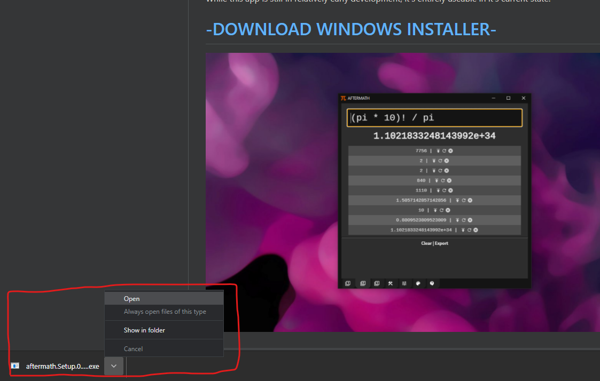
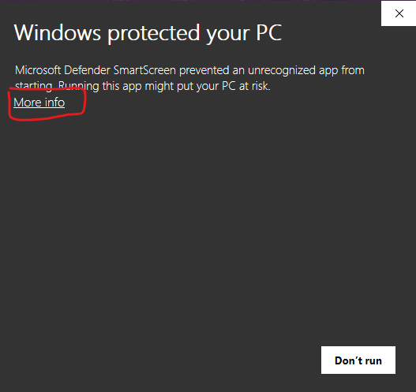
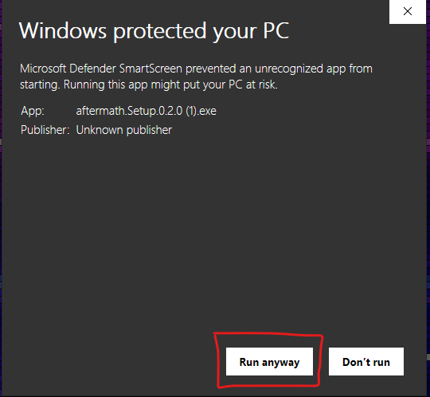

# Installing on Windows

You may have to bypass the Windows installer warning. 

On Windows 10 it will look something like this:

## Download and open the file

## Click "More Info"

## Click "Run Anyway"

## NOTE

Normally doing this can be a bad idea. However, AfterMath is 100% open source code that is publicly available for audit. I am a professional software developer and this code is being released under my real name. 