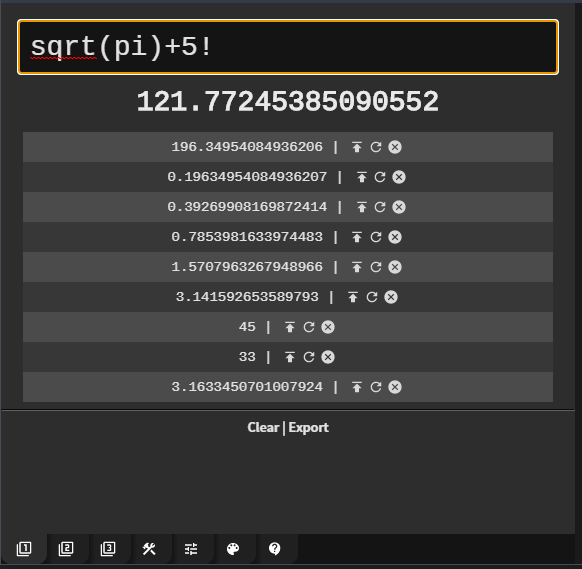

# AfterMath

AfterMath is an over-engineered calculator written in JavaScript.

*If you're wondering why anyone would want a 100mb+ calculator app running on Electron, then this project is not for you.*

While this app is still in relatively early development, it's entirely useable in it's current state.

# [-DOWNLOAD WINDOWS INSTALLERS-](https://github.com/matdombrock/AfterMath/releases)



---

## Features

* Advanced text based evaluation powered by MathJS
* Multiple tabs to separate your calculations
* Powerful history features such as restoring previous equations
* Formula tools to work with percentages, dates, times, unit conversions ect.
* Fully customizable with settings and themes

*Note: Some of these features are still in development.*

---

# Usage

## Basic Usage
Enter your equation into the input field.
Your result will show below the input field as soon as one is available.
If you would prefer not to have the result update as you type, this can be disabled from the settings menu.


If your equation is not solvable you will see output looking something like this: ಠ╭╮ಠ


Getting any sort of emoticon means that the result is currently not a number (NaN). 
This is much like seeing "Syntax Error" on a classic calculator. Just more fun. 

---

## Result History
To save an your current result to the history, hit the 'enter' or 'return' key. 
This will also automatically insert your current result into the input field (much like a traditional calculator would).
If you would prefer to not have the current result inserted into the input field, you can disable the 'Update Equation' setting. 


Assuming the 'Show Advanced History' setting is on, you can:
* Load Result - Loads the result directly into input field
* Restore Equation - Restore the equation that led to this result
* Delete - Delete the item from history


If the 'Show Advanced History' setting is disabled, the only thing you can do is click history items which will restore them to the input field.

---

## Basic Expression Syntax
Expressions (sometimes incorrectly referred to as equations) are written much like you would enter them on a traditional calculator. For instance you might write something like this:

```
1/2+3
```

The above expression could be stated as '1 divided by 2 plus 3'. The result here would be `3.5`.

**You can use parenthesis at any point to override the order of operations:**

```
1/(2+3)
```

The above expression could now be stated as '1 divided by the sum of 2 and 3'. 
The result would be `0.2`.

**Implicit multiplication is allowed, but (as you might expect) only against constants.**

```
3 + 2 pi
```

Note: *Behind the scenes, **AfterMath** is using a tool called [MathJS](https://mathjs.org/). Specifically, it's using the '[evaluate](https://mathjs.org/docs/expressions/parsing.html)' function. This is a very powerful math evaluation system. If you're reading this section, I think there is a good chance you have seen a syntax something like this before.*

[Full Expression Docs From MathJS](https://mathjs.org/docs/expressions/syntax.html)

---

## Constants
Thanks to [MathJS](https://mathjs.org/), **AfterMath** has a ton of useful constants available.

* e, E
* i
* Infinity
* NaN
* null
* phi
* pi, PI
* many more!

[-Full List Of Available Constants-](https://mathjs.org/docs/reference/constants.html)

---

## Simplification
If the 'Enable Simplification' setting is on, **AfterMath** will attempt to simplify anything it can't solve. For example:

```
1x + 2x
```

The above input would be simplified to `5 * x`.

---

## Unit Conversion
Assuming you have the 'Enable String Output' setting on, **AfterMath** can handle unit conversions as well as advanced math involving units. For example:

```
1 inches to cm
```

Which of course results in an output of `2.54 cm`.

If you want to get up the ante, you could even do something like:

```
sqrt(pi) litre / 1 teaspoon
```

Which yields you the highly valuable result of `354.4907701811032`.

**Length**:

meter (m), inch (in), foot (ft), yard (yd), mile (mi), link (li), rod (rd), chain (ch), angstrom, mil

**Surface**:

area	m2, sqin, sqft, sqyd, sqmi, sqrd, sqch, sqmil, acre, hectare

**Volume**:

m3, litre (l, L, lt, liter), cc, cuin, cuft, cuyd, teaspoon, tablespoon

**Liquid**:

volume	minim (min), fluiddram (fldr), fluidounce (floz), gill (gi), cup (cp), pint (pt), quart (qt), gallon (gal), beerbarrel (bbl), oilbarrel (obl), hogshead, drop (gtt)

**Angles**:

rad (radian), deg (degree), grad (gradian), cycle, arcsec (arcsecond), arcmin (arcminute)

**Time**:

second (s, secs, seconds), minute (mins, minutes), hour (h, hr, hrs, hours), day (days), week (weeks), month (months), year (years), decade (decades), century (centuries), millennium (millennia)

**Frequency**:

hertz (Hz)

**Mass**:

gram(g), tonne, ton, grain (gr), dram (dr), ounce (oz), poundmass (lbm, lb, lbs), hundredweight (cwt), stick, stone

**Electric**:

current	ampere (A)

**Temperature**:

kelvin (K), celsius (degC), fahrenheit (degF), rankine (degR)

**Amount**:

of substance	mole (mol)

**Luminous**:

intensity	candela (cd)

**Force**:

newton (N), dyne (dyn), poundforce (lbf), kip

**Energy**:

joule (J), erg, Wh, BTU, electronvolt (eV)

**Power**:

watt (W), hp

**Pressure**:

Pa, psi, atm, torr, bar, mmHg, mmH2O, cmH2O

**Electricity**:

and magnetism	ampere (A), coulomb (C), watt (W), volt (V), ohm, farad (F), weber (Wb), tesla (T), henry (H), siemens (S), electronvolt (eV)

**Binary**:

bits (b), bytes (B)

[-Full List Of Available Units-](https://mathjs.org/docs/datatypes/units.html#reference)

